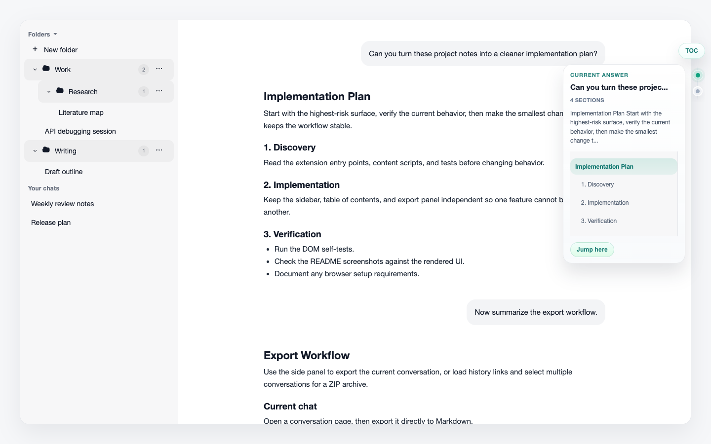
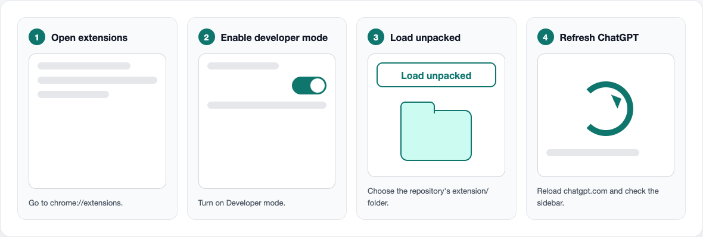
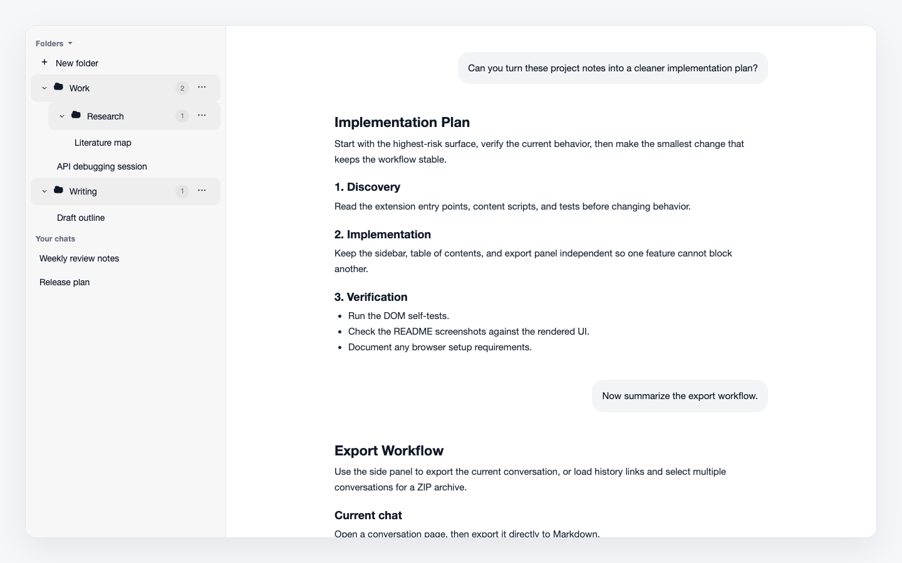
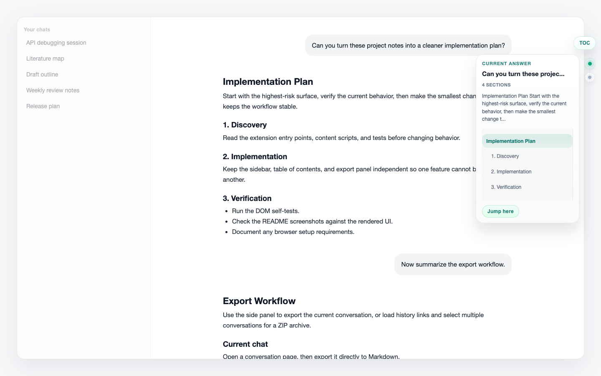
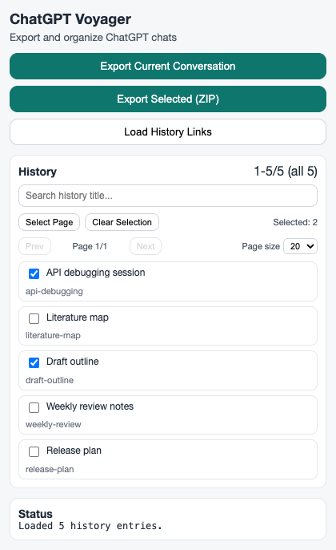

[English](./README.md) | [简体中文](./README.zh-CN.md)

# ChatGPT Voyager

Turn ChatGPT into a workspace you can organize, scan, and export.



ChatGPT Voyager is a local-first Chrome extension for `chatgpt.com`. It adds:

- nested folders inside the native ChatGPT sidebar
- a right-side table of contents for long assistant answers
- Markdown and ZIP export tools for conversations you want to keep

The extension stores its organization data locally in your browser. It does not sync folders to ChatGPT servers and does not modify ChatGPT server-side data.

## Why Use It

ChatGPT history becomes hard to manage once it holds research, coding threads, drafts, reviews, and long-running projects. Voyager gives that history a workspace shape:

- put related chats into folders and subfolders
- preview long answers before jumping around the page
- export useful conversations into files you can archive or reuse elsewhere

## Install From Source



1. Clone or download this repository.
2. Open `chrome://extensions`.
3. Enable `Developer mode`.
4. Click `Load unpacked`.
5. Select the `extension/` directory from this repository.
6. Open or refresh `https://chatgpt.com`.
7. Confirm that `Folders` appears in the ChatGPT sidebar.

## Sidebar Folders



Use folders when your ChatGPT history starts to feel like a flat pile.

1. Open `https://chatgpt.com`.
2. Find `Folders` in the left sidebar.
3. Click `New folder` to create a top-level folder.
4. Use the folder `...` menu to rename, delete, or create a subfolder.
5. Drag conversations into folders, or open ChatGPT's native conversation `...` menu and choose `Move to folders`.
6. Drag a folder into another folder to create a nested tree.

Notes:

- Folders are local to this extension.
- Deleting a folder removes the local folder tree only; it does not delete ChatGPT conversations.
- Cached conversations can remain visible in folders even before ChatGPT has reloaded the full native history list.

## Right-Side TOC



Use the right-side TOC to move through long assistant replies without losing your place.

1. Open any ChatGPT conversation page, such as `/c/<id>`.
2. Click the `TOC` pill on the right side of the page.
3. Click a dot to preview the corresponding assistant answer.
4. Inspect the preview card: previous user prompt, answer excerpt, and Markdown headings.
5. Click `Jump here` or a section title when you are ready to scroll.

Notes:

- Dots preview first; they do not immediately scroll the page.
- The TOC is collapsed by default.
- Only assistant Markdown headings are included.

## Export Conversations



Open the ChatGPT Voyager side panel when you want to save conversations outside ChatGPT.

Export the current conversation:

1. Open a concrete ChatGPT conversation page.
2. Open the extension side panel.
3. Click `Export Current Conversation`.

Batch export:

1. Open the extension side panel.
2. Click `Load History Links`.
3. Search, paginate, and select the conversations you want.
4. Click `Export Selected (ZIP)`.

## Repository Layout

- `extension/`: Chrome extension source
- `assets/readme/`: README screenshots and installation schematic
- `scripts/`: release, packaging, and documentation asset scripts
- `tests/`: no-build DOM and release self-tests

## Development

Install dependencies:

```bash
npm install
```

Run focused checks:

```bash
npm run test:toc
npm run test:extract
npm run test:folders
npm run test:release
```

Regenerate README screenshots:

```bash
node scripts/generate-readme-assets.mjs
```

Live ChatGPT extraction smoke test:

```bash
npm run test:cdp
```

`test:cdp` requires a Chrome instance with remote debugging enabled at `127.0.0.1:9222` and a signed-in ChatGPT session.

## Current Version

- `v0.4.2`
